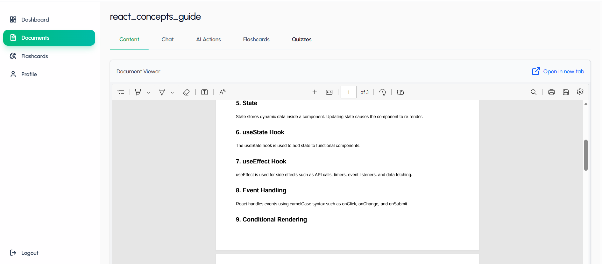

# 🧠 AI-Powered Learning Assistant

An intelligent learning platform that transforms uploaded documents into interactive study materials using AI. Users can upload PDFs, chat with documents, generate summaries, explain concepts, create flashcards, take quizzes, and track learning progress through a personalized dashboard.


## 🚀 Live Demo

### https://ai-powered-learning-assistant-app-two.vercel.app


## ✨ Features

### 📄 Document Management
- Upload and manage PDF documents
- Extract and process document content
- View document details and learning materials

### 🤖 AI-Powered Learning Assistant
- Chat with your documents using natural language
- Ask questions and receive context-aware answers based on the uploaded document
- AI-generated responses grounded in document content

### 📝 AI Document Summarization
- Generate concise summaries of uploaded documents
- Quickly understand key concepts and important information
- Save time when reviewing large study materials

### 💡 Concept Explanation
- Enter any topic or concept from the document
- Receive detailed AI-generated explanations
- Simplifies complex topics for better understanding

### 🃏 Flashcard Generation
- Automatically generate flashcards from document content
- Interactive flashcard review experience
- Improve retention through active recall

### 🧩 Quiz Generation
- Generate quizzes from uploaded documents
- Multiple-choice questions
- Instant scoring and feedback

### 📊 Learning Dashboard
- Track learning activity
- View recent document interactions
- Monitor flashcard and quiz statistics

### 🔐 Authentication & Security
- User registration and login
- JWT-based authentication
- Protected routes and secure API access

## 🚀 Key AI Features
- Retrieval-based document question answering
- AI-powered document summarization
- Context-aware concept explanation
- Automated flashcard generation
- Automated quiz generation

## 🛠️ Tech Stack

### Frontend
- React.js
- React Router DOM
- Tailwind CSS
- Axios
- Lucide React
- React Hot Toast

### Backend
- Node.js
- Express.js
- MongoDB
- Mongoose
- JWT Authentication
- Multer

### Deployment
- Vercel (Frontend)
- Render (Backend)
- MongoDB Atlas

## 📂 Project Structure

```text
AI-Learning-Assistant/
│
├── backend/
│   ├── config/              # Database and app configuration
│   ├── controllers/         # Request handlers
│   ├── middleware/          # Authentication & error handling
│   ├── models/              # MongoDB schemas
│   ├── routes/              # API routes
│   ├── uploads/             # Uploaded PDF documents
│   ├── utils/               # Utility functions & AI helpers
│   ├── .env
│   ├── server.js
│   └── package.json
│
├── frontend/
│   ├── public/
│   ├── src/
│   │   ├── components/      # Reusable UI components
│   │   ├── context/         # Authentication context
│   │   ├── pages/
│   │   │   ├── Auth/
│   │   │   ├── Dashboard/
│   │   │   ├── Documents/
│   │   │   ├── Flashcards/
│   │   │   ├── Quizzes/
│   │   │   └── Profile/
│   │   ├── services/        # API communication
│   │   ├── App.jsx
│   │   └── main.jsx
│   │
│   ├── index.html
│   ├── vite.config.js
│   └── package.json
│
├── .gitignore
└── README.md
```

## 📸 Screenshots




---